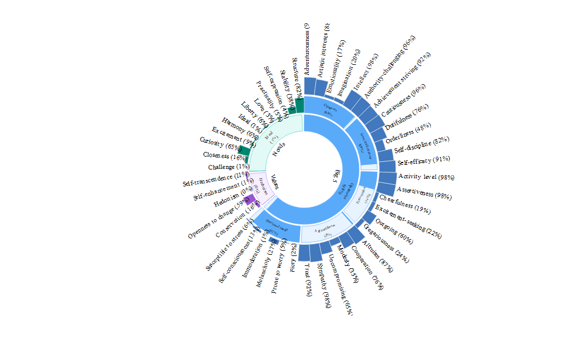

[](https://www.repostatus.org/#wip)
[](https://travis-ci.org/lockedata/ibmsunburst)
[](https://codecov.io/gh/lockedata/ibmsunburst?branch=master)

# IBM Personality Insights sunburst diagrams in R

The goal of ibmsunburst is to wrap the [javascript library that IBM have
produced](https://github.com/personality-insights/sunburst-chart/) for
making sunburst personality insights charts for use in R and rmarkdown
documents.

## Installations

Install `ibmsunburst` from GitHub

``` r
# install.packages("remotes")
remotes::install_gitub("lockedata/imbsunburst")
```

## Example

Below we input the path to a JSON file corresponding to the output of
[IBM Watson Personality Insights
service](https://www.ibm.com/watson/services/personality-insights/) and
visualize it.

``` r
json_path <- system.file(
  "extdata", "profiles",
  "en_v2.json", package = "ibmsunburst"
)

ibmsunburst::ibmsunburst(json = json_path, version = "v2")
```

<!-- -->

## Dev notes

[Kent Russel](https://github.com/timelyportfolio) added some
documentation of the changes that he made to the source
[sunburst-chart](https://github.com/personality-insights/sunburst-chart).
Find them [here](inst/dev_notes.md).
